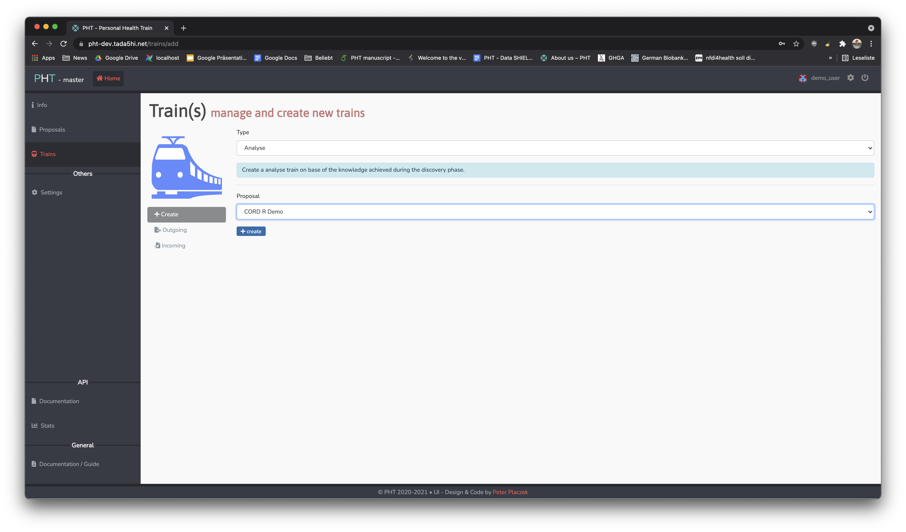
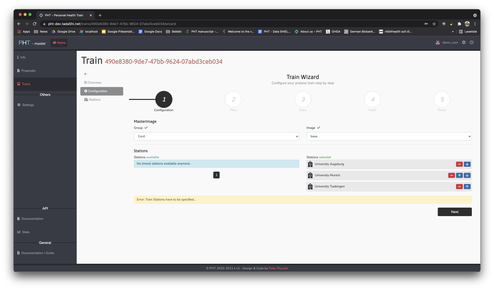
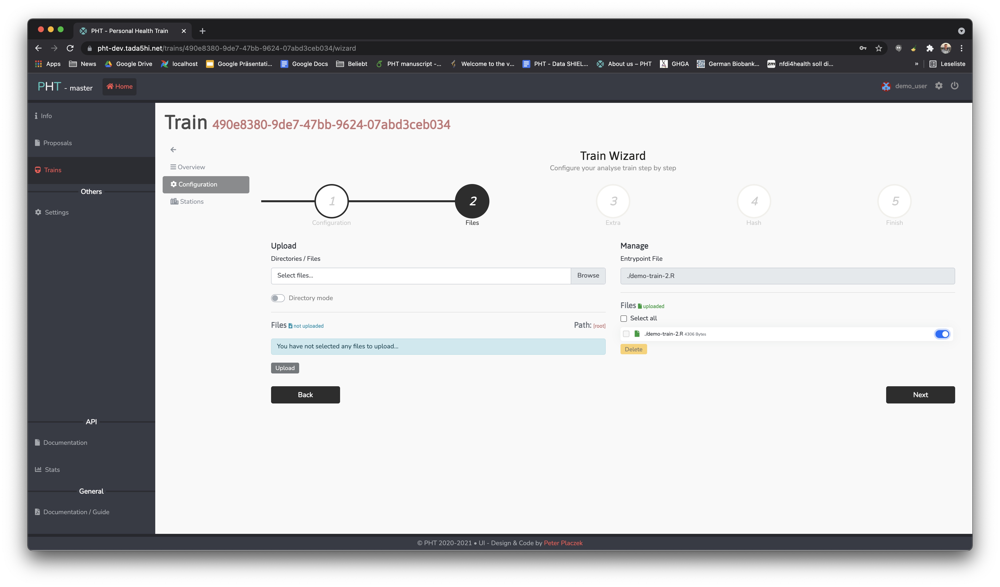
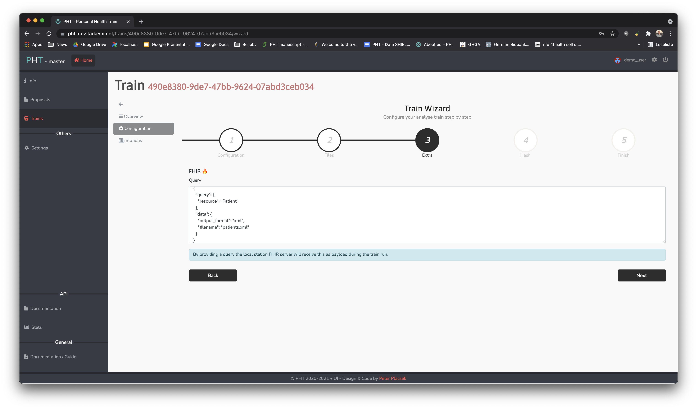
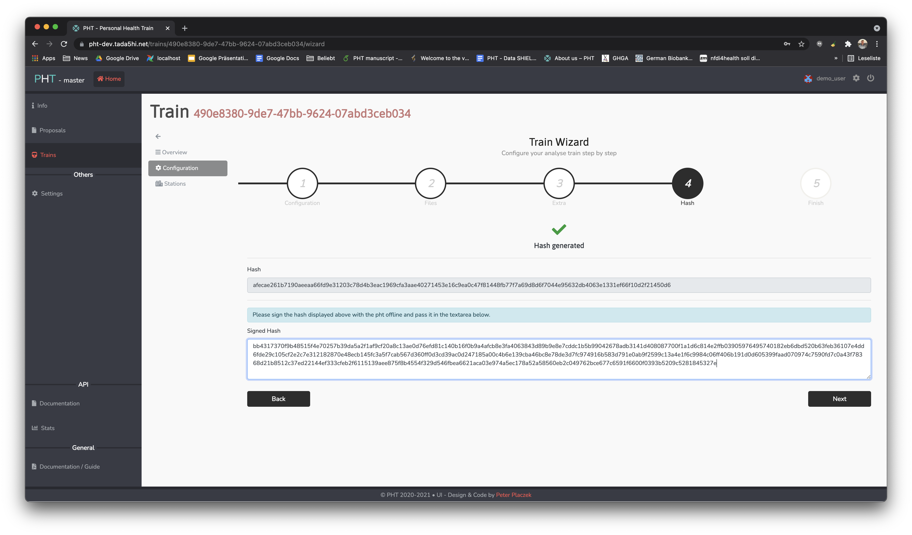
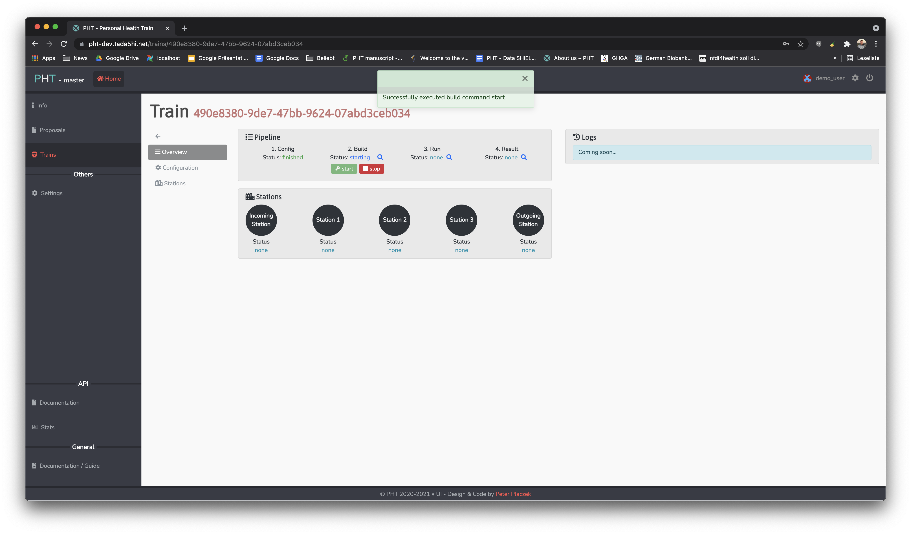
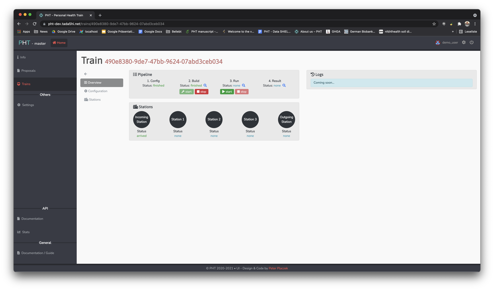
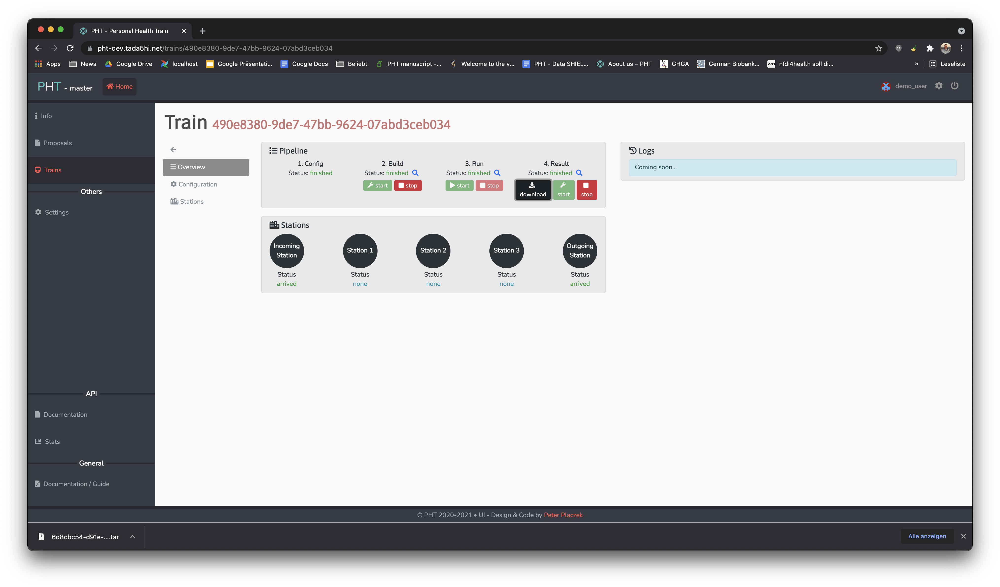
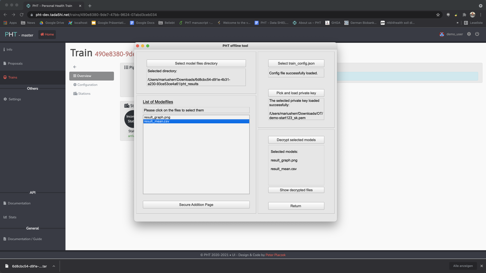
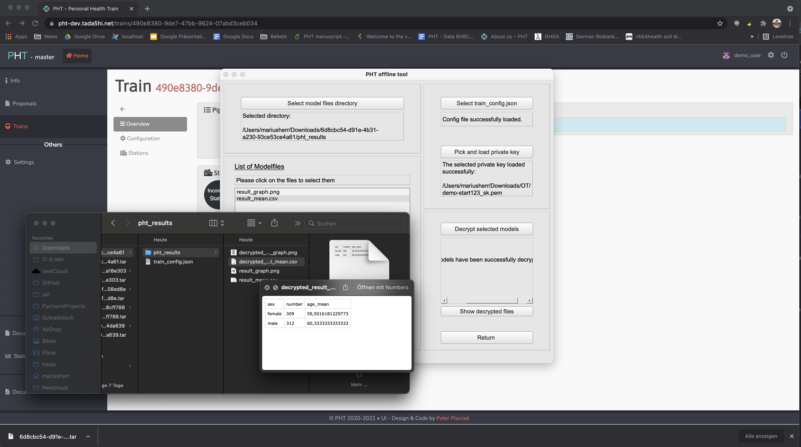

# PHT CORD Demo
This section will provide explanations and examples for writing and executing CORD demo code and queries by using PHT meDIC.
By using the demo account, we automatically accept and execute your analysis over three stations providing secure access to synthetic 
CORD demo data in FHIR.

Demo credentials for [PHT demo](https://demo.personalhealthtrain.de) username `demo_user` and password `cord_pht_demo`.
With this user you can use all functionalities and
take a look at our admin area. Don't worry and play around, you cannot break something and the system resets itself.

## Running CORD demo trains
We suggest to you to follow these steps:

1. Download and install our offline tool.
2. Load the private keys.
3. Train submission
   1. Define your FHIR query to be executed (see section below).
   2. Define your analysis (see section below).
   3. Submit your code (see section below).
4. Run the train.
5. Decrypt results.

### Step 1 - Preliminaries
1. Download and install the offline tool from our [releases page](https://github.com/PHT-Medic/offline-tool/releases).
2. The demo user has predefined [keys](https://github.com/PHT-Medic/cord-pht-demo/tree/master/cord-demo-keys). Please download those.
3. Login our [PHT demo page](https://demo.personalhealthtrain.de) with username `demo_user` and password `cord_pht_demo`.

### Step 2 - Offline Tool and key loading
 Get familiar with its functionalities additional infos can be found in the
[offline tool documentation](../user_guide/offline_tool.md).

You need to download and use the [keys](https://github.com/PHT-Medic/cord-pht-demo/tree/master/cord-demo-keys) in order 
to decrypt the analysis results.
Go to the `Security` Section of the tool and load the previous downloaded `demo-start123_sk.pem` private key.
You need to enter the password of the private `start123`. Now you can continue with train submission - you will need to sign
with your private key your submitted code and query.

### Step 3 - Train submission
For this CORD PHT demo we recommend using or customizing an example train. Please clone this [repository](https://github.com/PHT-Medic/cord-pht-demo) if you want to
use our example trains.

Now you need to decide if you want to run a [Python](cord_python.md) or [R](cord_r.md) analysis.
By writing the analysis code, you specify the data access, we recommend using FHIR.

#### Step 3.1 FHIR queries
Our self implemented train-library not only includes security but also standardised FHIR query execution and access and
currently supports the following servers: IBM, Hapi and Blaze. In this demo we use Blaze FHIR servers.

Read this section for details regarding FHIR queries: [FHIR query documentation](cord_fhir.md) or continue with the train submission.

#### Step 3.2 - write your analysis code
In any IDE you can write your analysis code. We suggest to use PyCharm for Python and RStudio for R code.
These following examples will be executed at each station. Please get familiar with the following Python or R code:

R demo trains code is documented here: [R CORD documentation](cord_r.md)

Python demo trains code is documented here: [Python CORD documentation](cord_python.md)

#### Step 3.3 - code submission
Upload your analysis code within the UI and select the entrypoint (script to be executed at stations if multiple files are submitted).
The hash of the uploaded files and query needs to be signed by using the Offline Tool with your private key. The next steps guide you through submission.

1. Login to the UI
2. Create a new train
3. Select the CORD Demo in the desired programming language for your proposal
  
   
  
5. Specify the stations to be executed at and select depending on your programming language the master image.
    

7. Upload the algorithm and select the entrypoint of the train.
       
8. Specify the query
       
9. Sign the hash with the local Offline Tool [documentation](../user_guide/offline_tool.md#sign-hash)
        

### Step 4 - Train running
You need to build and run the train before you can download the results.
Start the building process of the train.
     
Please reload the page within the browser after 30-40 seconds. Then you will be able to start the execution at the stations.
     

After a few minutes, results are available. A soon released feature will display the progress of the train in the Stations overview with a random station numbering.
The user will also be able to see log files of the train.

### Step 5 - result download and decryption
After a few minutes your train results can be downloaded. The files are automatically encrypted and need to be decrypted with the offline tool.
Please follow these steps:

1. Download results
     
2. Unzip the downloaded train results locally
3. Result decryption
   1. Open the offline tool
   2. Go to "Model" section
   3. Load your private key
   4. Open the unzipped result directory
   5. Load the train config file of your train
   6. Select the files to decrypt
   7. Decrypt the files by pressing the button
           
4. View, process and store the results locally your computer.
        

More information regarding result decryption can be read [here](../user_guide/offline_tool.md#decrypt-results).
The decrypted files can be accessed from you explorer or finder locally.

## FAQ
### Train not updating
**Question: My train is not updated in the UI, what can I do?**

**Answer** Most likely your code or query has caused an error during execution. We work on extending this version, to provide you with
log files from the execution.

### Is this the PHT?
**Question: Is this the Personal Health Train?**

**Answer** This is the implementation of the PHT from Tübingen University (PHT-meDIC). Many other versions exist.

### Any difference in the demo?
**Question: Is the PHT-meDIC as it would operate on real patient data?**

**Answer** All services are interacting in this demo, as it would be on real data.
But there is a major difference: any train will be approved and executed. There is no one to validate, if something malicious is ongoing.
In case you saved all patient data as fake results in the train, you did not break the system nor hacked the architecture. We allowed you and automatically executed your train to do such.