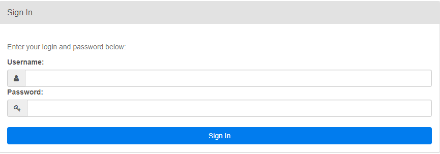

# PHT Station

This section will provide installation instructions for installing a PHT Station. It assumes that the station has been
registered in the UI.

## Installation
Visit
the [station repository](https://gitlab.com/PersonalHealthTrain/implementations/germanmii/difuture/station/station)
to view the code (the installation instructions can also be found here).

### Requirements

[Docker](https://docs.docker.com/get-docker/) and [docker-compose](https://docs.docker.com/compose/install/) need to be
installed. For the default installation to work the ports `8080` and `5432` need to be available on localhost. 


### Install with docker-compose
Clone the repository  
```shell
git clone https://gitlab.com/PersonalHealthTrain/implementations/germanmii/difuture/station/station.git
```

1. Navigate into the cloned project `cd station` and edit the `.env` file with your local configuration.
    - `FHIR_ADDRESS` the address of the default fhir server connected to the station (this can also be configured per train)
    - `FHIR_USER` username to authenticate against the FHIR server using Basic Auth
    - `FHIR_PW` password for Basic Auth
    - `FHIR_TOKEN` Token to authenticate against the FHIR server using Bearer Token
    - `FHIR_SERVER_TYPE` the type of fhir server (PHT FHIR client supports IBM, Hapi and Blaze FHIR servers)
    - `HARBOR_API_URL` the url of the central harbor instance
    - `HARBOR_USER` username to authenticate against harbor
    - `HARBOR_PW` password to authenticate against harbor
    - `STATION_ID` Chosen identifier of the station (match central UI configuration)
    - `STATION_PRIVATE_KEY_PATH` path to the private key on the local filesystem that will be mounted as a volume
    - `AIRFLOW_USER` admin user to be created for the airflow instance 
    - `AIRFLOW_PW` password for the airflow admin user
2. Create a volume for the station with ```docker volume create --name=pg_pht_station```
3. Bring up the project by running `docker-compose up -d`
4. Check the logs for any errors while bringing up the project `docker-compose logs`


## Getting started with Airflow
Trains and other station tasks are executed via airflow DAGs. The DAGs can be triggered via the airflow web interface,
which is available under `http://127.0.0.1:8080` on the station machine. 
The execution of the DAGs can also be monitored in the webinterface

### Login
The first time you access the webinterface you will be prompted to log in. Enter the credentials set in the `.env` file 
to login as admin.



### Triggering the test DAG
To test the configuration of the station as defined in the `.env` file, trigger the DAG named `test_station_configuration`
in the user interface.  
A DAG is triggered in the UI by clicking on the "play" button, where it can be started either with or without a json 
file containing additional configuration for the DAG run.


Trigger the DAG without any additional configuration to check if the station is properly configured. A notification should
appear in the UI that the DAG has been triggered.  

To monitor the execution click on the name of the DAG. You should see the individual tasks contained in the DAG as well as
their status in the UI. If all tasks are marked as success, the station is properly configured and can connect to harbor
as well as a FHIR server.


### Accessing logs

The logs stored during the execution of a DAG can be accessed for each individual task by clicking the indicator next 
to the name of the task and selection Log in the pop-up window that appears.


If there are any errors stacktraces can be found in these logs, as well as any other output of the tasks (stdout, stderr)


### Running a train

To execute a train that is available for your station, trigger the `run_train` DAG, with configuration options specifying
the train image to be pulled from harbor and executed as well as additional environment variables or volumes. A template
train configuration is displayed below. 

```json
{
  "repository": "<HARBOR-REGISTRY>/<STATION_ID>/<TRAIN-IMAGE>",
  "tag": "latest",
  "env": {"FHIR_ADDRESS": "<FHIR-ADRESS>","FHIR_USER": "<ID>","FHIR_PW": "<PSW>"}
}
```

Replace the placeholders with the values of the train image to execute, and other
variables with the values corresponding to the stations configuration and paste it into the configuration form shown in 
the following image.


