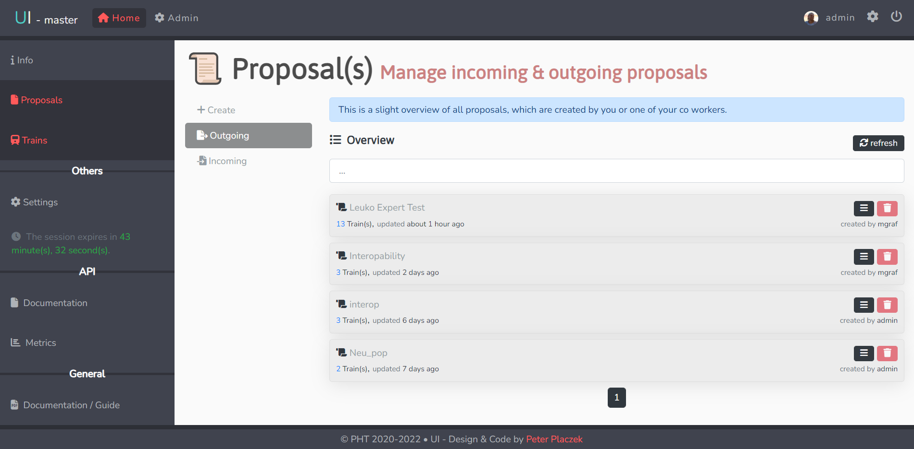
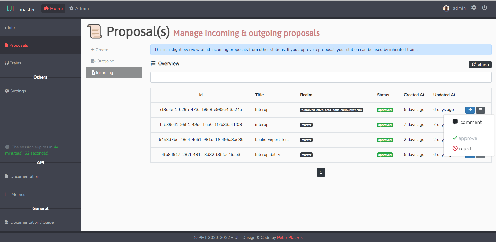
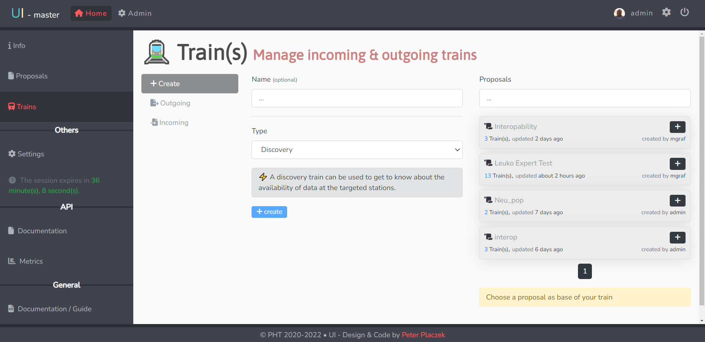
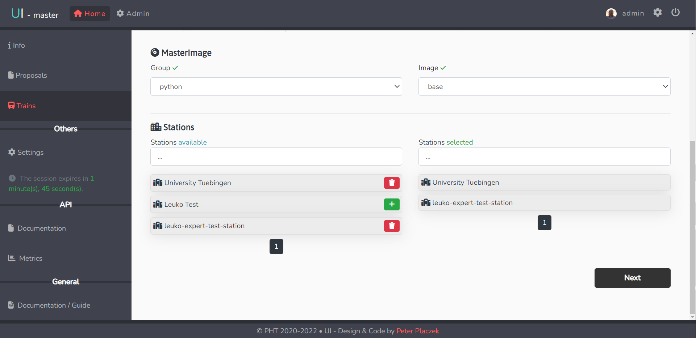
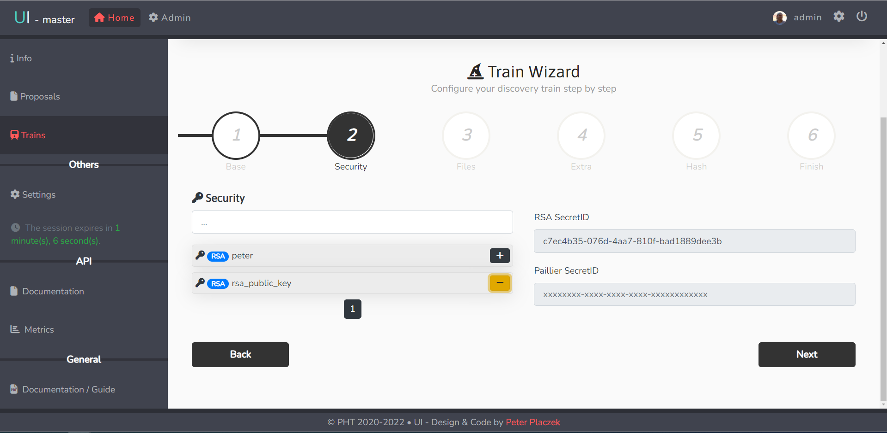
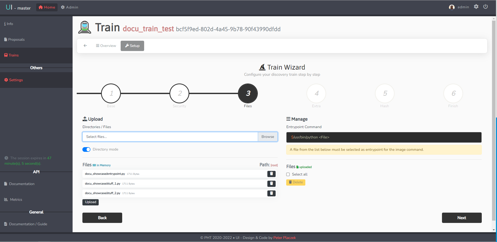
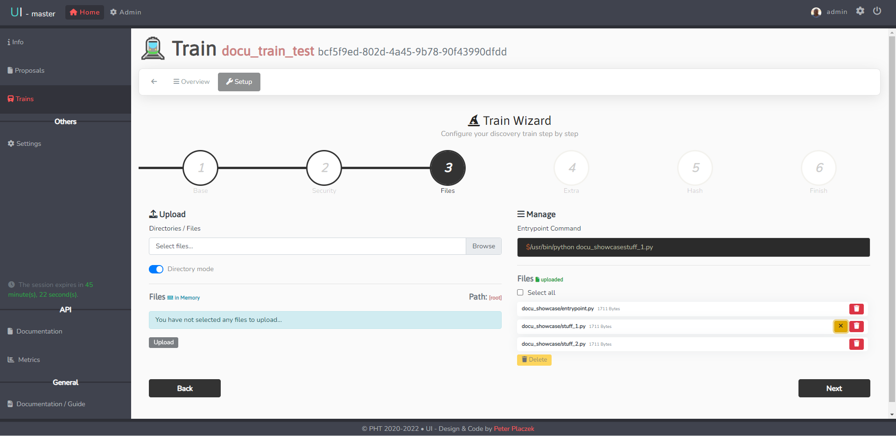
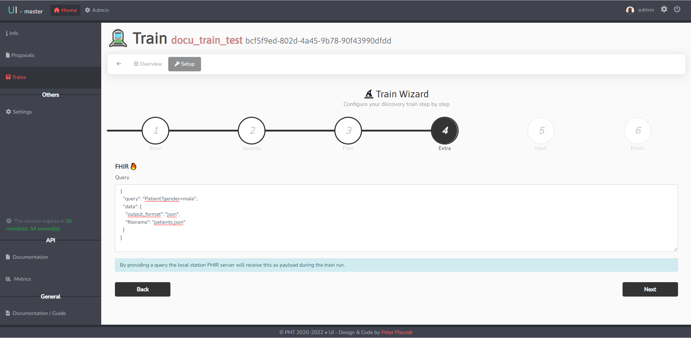
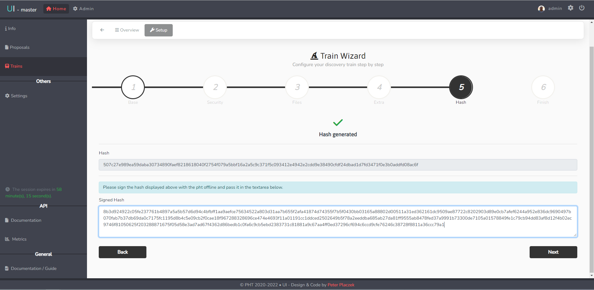
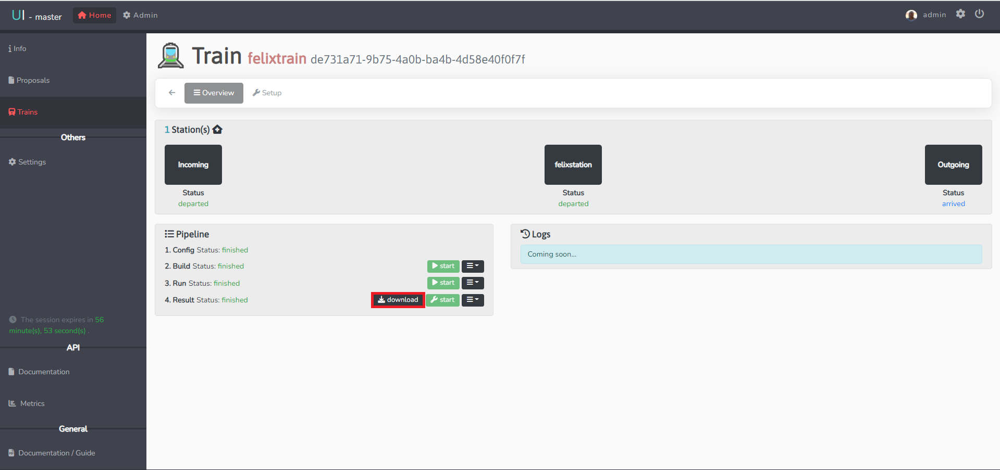

# User Interface

!!! warning
      The Link below (pht-ui.personalhealthtrain.de) is not properly working

The User Interface (UI) is the central control interface [pht-ui.personalhealthtrain.de](https://pht-ui.personalhealthtrain.de)
to interact with the PHT. Its main tasks are the administration of stations and train proposals
but also the submission of analysis-trains and consequently receiving encrypted results.

## User Account Configuration

### Registering/Updating a public key
After signing in for the first time you should register a public key in the UI (Vault).
In the **Home** section press **Settings** in the menu on the left-hand side and then press **Secrets**.

You can define the ...

- ... *key type*: You can choose between an RSA-key and a Paillier-key
- ... *key name*: The preferred name for this specific key

Furthermore, you do have two options for loading the key into the system:

1. Load the key via the file path (through the **Browse** option)
2. Copy and paste the whole key into the **Content**-section.

On the right sight, you will then find each already stored keys with specific name as list below the **Overview** and the search bar (where you can filter after a specific key in the list)

## Proposals
A Proposal is an organizational unit in the PHT, which represents the collaboration between different participants in regard to a specific research or analysis project.  
It contains an initial risk assessment as well as a high level description of the requested data.

In the **Home** section press **Proposals** in the menu on the left-hand side.
At first, you will lead to the **outgoing**-proposals section, where you can see a list of all the proposals created by this station. Via the searchbar you can filter after the name.
You have the option to adjust the already existing proposals via the **List**-icon or to delete the proposal via the **bin**-icon. Furthermore, you can see, who exactly created that proposal.

Moreover, you have the option to switch to the **incoming** section or to create a new proposal on the left side between the menu and the overview-list.

### Creating a new Proposal

After pressing the **Create**-button, it will take you to a new form. Here you can define principal aspects of you train. You can define ...

- ... a title of the proposal.
- ... the group where you can choose from cord, python, leuko-expert and R
- ... Additionally you can select the Image such as *base* (for cord | leuko-expert | python), *ml* (for python | r) and *conda* , *pytorch* , *tensorflow* (for python).
- ... the risk level and specifies it by context in the risk comment: *Low* | *Mid* | *High*.
- ... to which of the known stations you want to send this proposal. (You can choose multiple stations by clicking on the green **+**-icon.)
- ... some Data/Parameters information, which will be necessary for the training algorithm in the **Data/Parameter**- text block.

After clicking on the create-button the proposal will be sent to all the selected stations, such each side can approve/reject the analysis.

#### Definition of Risk
A train is working on specific data from the different station but data can be quite differentiable depending on combinations of all data. Private data is really sensitive and needs to be handled accordingly. So we give a Risk, so each station can have a clue about what kind of data will be used during the stopover of the train.
For this we have three stages:

- Low risk (*green*): The train won't use any personal related data, such as calculation about all Loinc-Codes of Observation-Resources in a FHIR-Server.
- Mid risk (*yellow*): The train will use only one or quite few personal information of a patient such as the gender or the age. One param will not be harmful at all, but should still be mentioned when used during the process.
- High (*red*): The train in general will perform some calculations / analysis on private data where it can be possible that private information can be figured out about a single person. This can occur when the calculations will be performed on only a few participants with many private data about them. Overall this should not be an issue, when the FHIR-Servers provide enough privacy preserving measurements such as pseudonymization or anonymization.

### Accepting/Rejecting an incoming proposal
Within the incoming section of each station, a station authority can independently decide to comment, approve or reject
a study proposal for analysis. In order to do such, click on the **list**-icon on the right side of the corresponding proposal and select the preferred action.

## Train submission
### 1. Add User keys
Follow the description in **User Account Configuration** -> **Registering/Updating a public key**

### 2. Create a new train
In the **Home** section you can choose **Trains** in the menu on the left-hand side. You will lead to the **Outgoing** page where you can switch to the creation form via the **Create** button inbetween the menu and the overview-list.
#### 2.1. Define pre-parameters of the new train
On this page you can define:

- an *optional* **name** for the given train.
- which **type** of train you want to create. There are two options:

      1. **Discovery**: A discovery train can be used to get to know about the availability of data at the targeted stations.
      2. **Analysis**: An analyse train should be created on base of the knowledge achieved during the discovery phase

- which **proposal** you want to add to the train. You can only send one proposal at the time.

Click on **create** to continue.

#### 2.2. Define MasterImage and choose Stations

At this point the MasterImage settings are taking from the chosen proposal but can still be changed.

Additionally, you can select those stations you want the train to be sent to. The order you selected the stations will define the path the train will pursue.

Click on **Next** to continue.

#### 2.3. Check the Security Settings

You need to select one of the possible public RSA-keys for encrypting the train.

Additionally, you can add one Paillier-key to encrypt the results inside the train. 

Click on **Next** to continue.

#### 2.4. Load Code to the train

In the file-section of the train submission you can upload you Code-files, which the train will perform while visiting the different stations.

You can decide whether you want to upload only one single file or even a whole directory of files. Depending on you decision you need to mark or unmark the **Directory mode**-switch.

After you have selected the file or directory via the browse-button you can find all the files listed below. Depending on the folder, you may not wish to upload each file, so it is possible to delete some files at this point.

After uploading the files to the train you need to select one of the files as entrypoint. It is not name-depending as you can see in the picture below. You can select the specific file by clicking on the green-button. The chosen file will be displayed in the black textfield. *We have chosen the stuff_1.py as entrypoint for showing you, that it is not necessary to name one of your files "entrypoint".*

By clicking on the yellow **X**-button you deselect this file.

Additionally, you can delete some files as well at this point.

Click on **Next** to continue.

#### 2.5. Add a FHIR Query

In this **Extra**-section of the train submission you can past your valid FHIR Query to the train. It can be either the option with parameters or as URL version.

You can find more information about the query in this documentation under the section [User Guide -> FHIR Query](./fhir_query.md)

Here we used an example query from the FHIR Query documentation. 

#### 2.6. Create Hash and Signature 

One of the last steps it is to create a hash of the train started by this station. For this you need to generate the hash-value. (This could take some time)

After the hash value was generated, copy it and perform the signature on this with your private key. For this action you need to download and install the Offline Tool. How this signature is performed you can read it in this documentation under the section [User Guide -> Desktop App (Offline Tool)](./desktop_app.md)

The final signature from the Offline App you need to the textfield **Signed Hash**.

Click on **Next** to finish the configuration step.

### 3. Start the train

At this point the train is ready to be led loose on the track.

You can start the train by firstly build the whole train together (by clicking on the green **start**-button next to **Build**).

After a successful build train you can **Run** the train, which starts visiting the stations and perform your code.

Each station needs to start the code manually via the Airflow-Control of the station. You can find more information here: [Station](./station.md)

After running through all station, you can click on the **Download**-button on point **4.Result**. To decrypt the results, you need the [Desktop App (Offline Tool)](./desktop_app.md) again.

