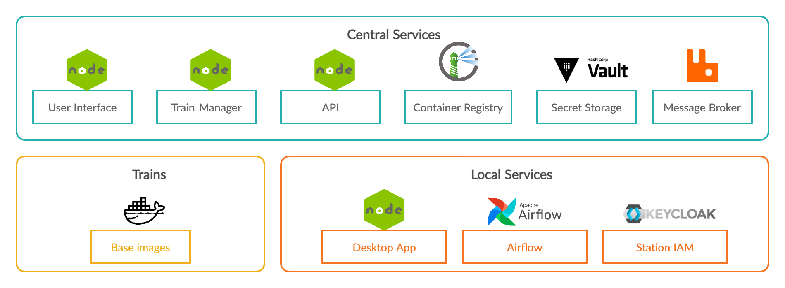
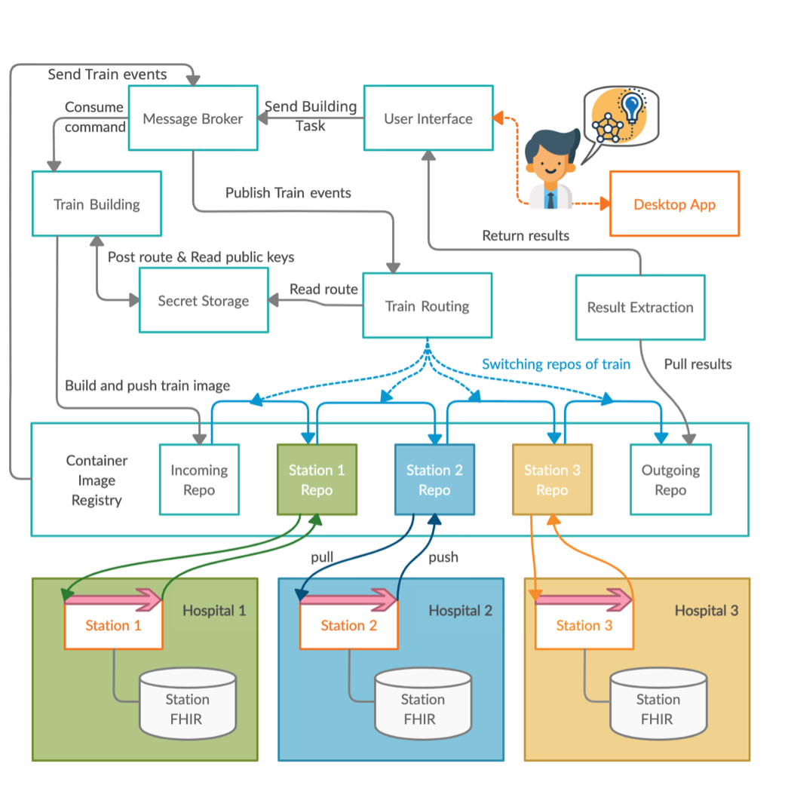
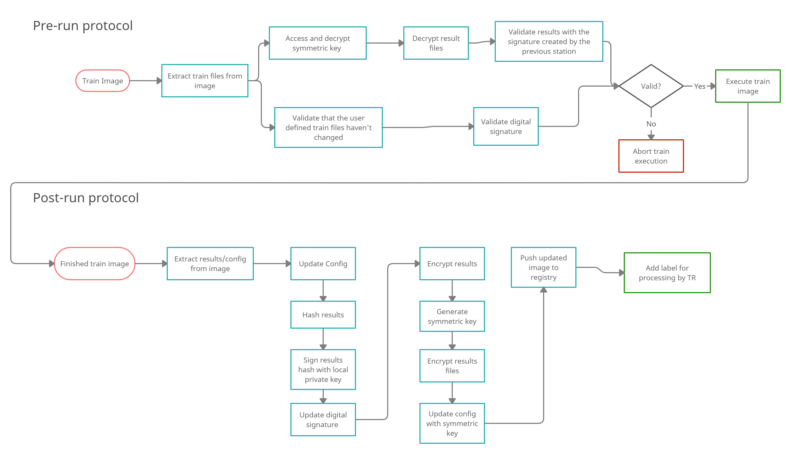

# Overview
Documentation and [User Guide](index.md) for the Personal Health Train (PHT) an open source, container based secure distributed analysis platform.
For more information about the PHT team, projects and collaborations you can also visit our [website](https://personalhealthtrain.de/).

## Introduction
The Personal Health Train (PHT) is a paradigm proposed within the [GO:FAIR initiative](https://www.go-fair.org/implementation-networks/overview/personal-health-train/) as one solution for distributed
analysis of medical data, enhancing their FAIRness. Rather than transferring data to a central analysis site, the
analysis algorithm (wrapped in a ‘train’), travels between multiple sites (e.g., hospitals – so-called ‘train stations’)
hosting the data in a secure fashion.

The following overview shows all interactions between service components to execute a train iteratively over three stations
with our PHT-TBI architecture.

## Mission Statement
From machine learning (ML) healthcare can profit by ‘learning’ models which support clinical practice in treatment decision
support systems (TDSS). To increase the robustness of an obtained model and produce meaningful results, generally the
analysis outcome depends on the number of training samples and data quality.

But meaningful data to improve predictions in medical research and healthcare is often distributed across multiple sites
and is not easily accessible. This data contains highly sensitive patient information, may consist at each site different
data formats and cannot be shared without explicit consent of the patient. Our goal is to make this data available for trains
with stations to support privacy preserving distributed machine learning in healthcare with our open-source implementation of the PHT.

Implementing trains as light-weight containers enables even complex data analysis workflows to travel between sites, for
example, genomics pipelines or deep-learning algorithms – analytics methods that are not easily amenable to established
distributed queries or simple statistics.

## Architecture

### Central Services
* `RabbitMQ` - Message broker for consuming and publishing commands & events between different services
* `Harbor` - Docker registry to manage (train-) images
* `Vault` - Secret storage to securely store sensitive information

* `User Interface (UI)` - Frontend application for proposal and train management, downloading of results and much more
* `API` - Backend application to manage resources and trigger commands & events through the message broker
* `Train Manager` - Microservice serving different components:
    * `Train Building` - Build and distribute train images to a registry
    * `Train Routing` - Move trains between projects & registries accordingly to the route of the train
    * `Result Extracting` - Download, extract & serve encrypted results from the registry

### Local/Station Services
* `Airflow` - Open-Source-Tool to create and schedule workflows and enables persistent access to data, execution and monitoring of trains
* `Keycloak` - Identity and Access Management (IAM) to manage users and roles

[comment]: <> (* Station UI - Self developed service, only from local network accessible to trigger train execution and resource monitoring.)
* `Desktop App` - GUI to manage key pairs and decrypt results locally

## Security

### Security Protocol
The following flow chart depicts the security protocol used for protecting participating stations against malicious code,
as well as encrypting any stored results using envelope encryption.   
This ensures that only approved algorithms 
are executed and that only previously registered participants in an analysis can access the results. 

## Languages

### JavaScript 
Wikipedia: *JavaScript ([https://developer.mozilla.org/en/docs/Web/JavaScript](https://developer.mozilla.org/en/docs/Web/JavaScript)) often abbreviated JS, is a programming language that is one of the core technologies of the World Wide Web, alongside HTML and CSS.*

### TypeScript
Wikipedia: *TypeScript ([https://www.typescriptlang.org/](https://www.typescriptlang.org/)) is a programming language developed and maintained by Microsoft. It is a strict syntactical superset of JavaScript and adds optional static typing to the language. 
It is designed for the development of large applications and transpiles to JavaScript.*

### Python
Wikipedia: *Python ([https://python.org](https://python.org/)) is an interpreted high-level general-purpose programming language. Python's design philosophy emphasizes
code readability with its notable use of significant indentation. Its language constructs as well as its object-oriented
approach aim to help programmers write clear, logical code for small and large-scale projects.*
